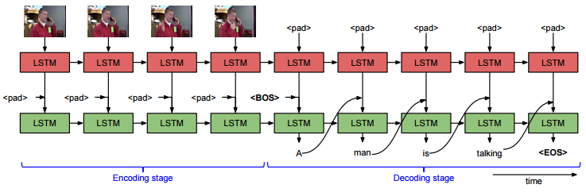
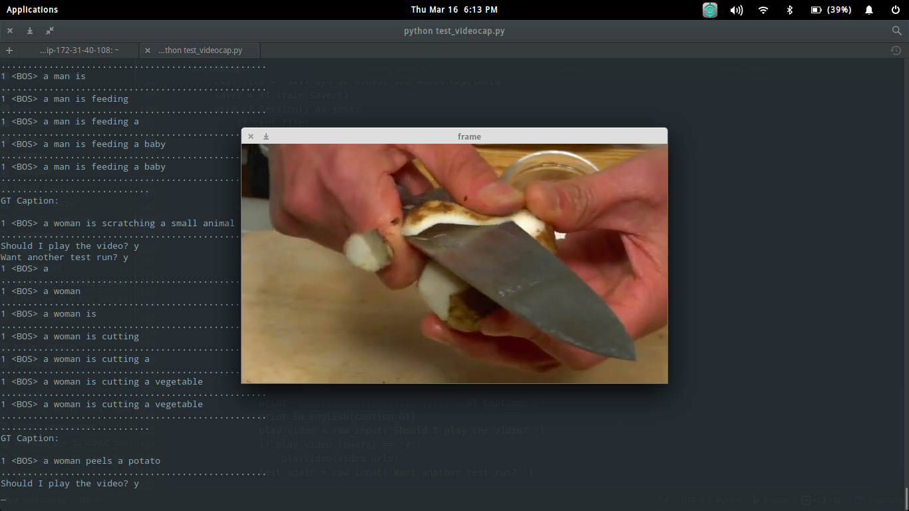

# Automated Video Captioning using S2VT

## Introduction
This repository contains my implementation of a video captioning system. This system takes as input a **video** and generates a **caption** describing the event in the video. 

I took inspiration from [Sequence to Sequence -- Video to Text](https://vsubhashini.github.io/s2vt.html), a video captioning work proposed by researchers at the University of Texas, Austin.

## Requirements
For running my code and reproducing the results, the following packages need to be installed first. I have used Python 2.7 for the whole of this project.

Packages:
* TensorFlow
* Caffe
* NumPy
* cv2
* imageio
* scikit-image

## S2VT - Architecture and working

Attached below is the **architecture diagram of S2VT** as given in their [paper](http://www.cs.utexas.edu/users/ml/papers/venugopalan.iccv15.pdf).

The **working** of the system while generating a caption for a given video is represented below diagrammatically.

## Running instructions

1. Install all the packages mentioned in the 'Requirements' section for the smooth running of this project.
2. Using [Vid2Url_Full.txt](text_files/Vid2Url_Full.txt), download the dataset clips from Youtube and store in <YOUTUBE_CLIPS_DIR>.
   * Example to use Vid2Url - {'vid1547': 'm1NR0uNNs5Y_104_110'}
   * YouTube video identifier - m1NR0uNNs5Y  
   * Start time - 104 seconds, End time - 110 seconds
   * Download frames between 104 seconds and 110 seconds in https://www.youtube.com/watch?v=m1NR0uNNs5Y
   * Relevant frames for video id 'vid1547' have been downloaded
3. Pass downloaded video paths and batch size (depending on hardware constraints) to extract_feats() in [Extract_Feats.py](Extract_Feats.py) to extract VGG16 features for the downloaded video clips and store in <VIDEO_DIR>.
4. Change paths in lines 13 to 16 in [utils.py](utils.py) to point to directories in your workspace.
5. Run [training_vidcap.py](training_vidcap.py) with the number of epochs as a command line argument. eg. python training_vidcap.py 10
6. Pass saved checkpoint files from Step 5 to [test_videocap.py](test_videocap.py) to run trained model on the validation set.

## Sample results

Attached below are a few screenshots from caption generation for videos from the **validation set**.

# Dataset

Even though S2VT was trained on MSVD, M-VAD and MPII-MD, I have trained my system **only on MSVD**, which can be downloaded [here.](https://www.microsoft.com/en-us/download/details.aspx?id=52422)

# Demo

A **demo of my system** can be found [here](https://www.youtube.com/watch?v=tmLzgFdI7Xg)

# Acknowledgements
* [Sequence to Sequence -- Video to Text](https://arxiv.org/abs/1505.00487) - Subhasini Venugopalan et al.
